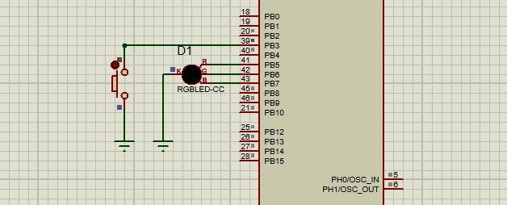

# RGB_LED_STM32

### Components:
- STM32f401cc Microcontroller
- RGB LED
- Push Button

Each button press changes RGB LED color to a new color from 8 combinations.

_Simulation using Proteus 8 Professional v8.10_